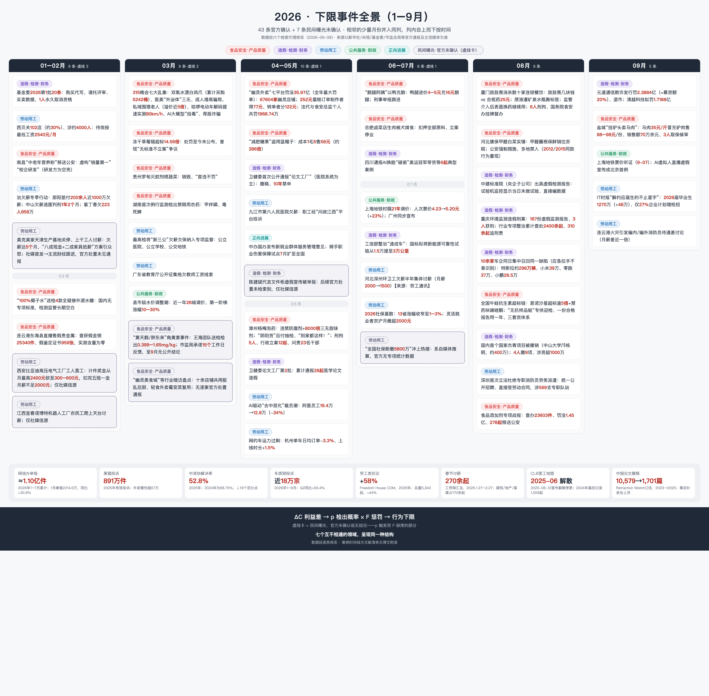

## 三个案例，同一个问题

2026 年 5 月，福建漳州。暗访记者问收购点的工人：泡过药的杨梅你们自己吃吗？答案是被无数人引用过的那句——"泡药的，我们自己都不敢吃。"同一场暗访里，收购点老板面对镜头理直气壮："**别家都这样！为什么就曝光我？**"他们备好没泡药的"阴阳货"应付抽检，泡过脱氢乙酸钠的杨梅发往浙江、上海，单家收购点旺季日销五千斤。事后追责：刑拘 5 人、行政立案 12 起、23 名干部问责。

2026 年 8 月，国家自然科学基金委员会公布年度第二批科研不端案件通报：**国内首个国家杰青项目被正式撤销**（中山大学，约 400 万元资助）。举报者不是任何制度内监督机构，而是一位科普博主。

2026 年 4 月，市场监管总局对拼多多、美团、京东、饿了么、抖音等七个平台开出**全年最大罚单：合计罚没 35.97 亿元**——纵容 67,604 家"幽灵外卖店"（伪造许可证 + 订单转单）。这笔罚单同时拆解了一个微观结构：一份 252 元的蛋糕订单，实际制作者得到 77 元，转单者分走 122 元。

这三个场景共享同一个细节：当事人**清楚地知道产品有害**——工人那句“泡药的我们自己都不敢吃”就是证据。知道有害，仍然照做，说明真正约束行为的不是“知不知道这是坏事”。那是什么？

> 是价格。**行为下限由三个变量决定：违规的成本节省 ΔC、检出概率 p、惩罚 F——下限落在 pF 追不上 ΔC 的地方。**

这个设定来自 Becker（1968）的犯罪经济学。下文先把它写成公式，再用 2023–2026 年间逐条核实的 50 起事件校准它，最后留下四个可以拿数据检验的问题。

---

## 下限的定价公式

### 违规的期望收益

考虑一个经营者，可以选择把质量从合规水平 $\bar{q}$ 降到 $q < \bar{q}$（掺违禁添加剂、省掉一道消杀工序、删掉一组测试）。质量降级带来的成本节省记为 $S(\Delta q)$，其中 $\Delta q = \bar{q} - q$，$S' > 0$——降得越狠省得越多。降级行为被查处的概率为 $p$，查实后的惩罚折算为货币等价 $F$。经营者的期望违规净收益：

$$ G(q, k) = \underbrace{S(\Delta q)}_{\text{成本节省}} - \underbrace{p(k)\cdot F}_{\text{期望惩罚}} - \underbrace{k}_{\text{隐匿投资}} $$

违规条件只有一个：$G > 0$。**行为下限** $q^*$ 定义为让这个式子恰好归零的最低质量水平：

$$ S(\Delta q^*) = p\cdot F $$

这是一个定价等式：**下限就是市场给"作恶风险"开的价。** 道德不在这个式子里。道德可以改变一个人对特定交易的参与意愿，但改变不了均衡价格——因为市场上总有别的供给者。

### 隐匿投入会压低被查概率

上面有个伏笔：$p(k)$ 写成了隐匿投资 $k$ 的函数。降低检出概率不是免费的——撕掉敌敌畏的标签灌进矿泉水瓶、给杨梅备"阴阳货"、给年检线装 OBD 干扰仪、养一批"无抗样品蛙"专供迎检、在试验机监控拍着的情况下直接编检测数据——**每一条都是花真金白银买的 $p$ 值折减**。设隐匿技术为指数形式 $p(k) = p_0 e^{-\lambda k}$，经营者对 $k$ 求最大化，一阶条件：

$$ -\frac{\partial p}{\partial k} F = 1 \;\Longrightarrow\; \lambda\, p(k^*)\, F = 1 \;\Longrightarrow\; p^* = \frac{1}{\lambda F} $$

这个内点解有三层含义，每一层都能在案例里找到对应：

1. **隐匿投资会把检出概率精确压到与惩罚成反比为止**。$F$ 定得越重，捂的技术就越精细——不是 paradox，是优化结果。
2. **对策随监管协同进化**。$\lambda$ 是"对策技术参数"：新京报暗访升级 → 消杀公司学会了监管介入后表面换合规药、实际继续用敌敌畏；杨梅商贩学会"打游击"；检测造假升级到"无车年检"和仿真数据补账面里程。监管每一次提高 $p$，都自动提高下一轮的 $\lambda$。
3. **观察到的"荒诞行为"是均衡的一阶条件**，不是当事人的愚蠢。撕标签这个动作，和实验室里求解 $p^* = 1/(\lambda F)$，是同一件事。

### 道德不是约束变量

对 $q^*$ 做比较静态：$\partial q^*/\partial(pF) > 0$——期望惩罚越高，下限越高；$pF$ 不动，下限不动。**这意味着"道德滑坡论"和"道德完好论"对行为的预测力相同，都为零。** 它们讨论的变量根本不在方程里。

这也解释了那个著名的困惑：为什么从业者一边说"我自己都不敢吃"。这句话只证明他们掌握**对自己有害**的信息（自我保护知识），不构成道德判断——知道有毒和认为不该卖给别人，中间隔着"别人"这个维度。社会学早就给这个缺口起了名字：**中和技巧**（Sykes & Matza 1957）——"大家都这样""不干就出局""凭什么曝光我"，五句话就把行为从道德评价里摘了出去。杨梅案里那句"别家都这样！为什么就曝光我？"是教科书级的中和话术，而且是新华社通报记录的原文。

---

## 为什么劣币驱逐良币

单企业的定价公式还不完整——它解释不了"为什么所有人都在做"。需要加两块拼图。

### 消费者验证不了质量

食品、消杀服务、检测报告有一个共同的属性：**消费者即使在消费之后也无法验证质量**（经济学里叫“信任品”，Darby & Karni 1973）。你吃不出杨梅里有没有脱氢乙酸钠,尝不出外卖后厨有没有转单,看不懂检测报告是真是假。信任品加上信息不对称,就是 Akerlof 1970 年柠檬市场的原始设定:买方只愿意按平均质量出价,**质量本身无法获得价格回报**。

质量拿不到溢价，价格就成了唯一的竞争维度。于是：

### 合规者被挤出市场

设合规成本 $c_h$，违规成本 $c_l < c_h$，成本节省 $S = c_h - c_l$ 正是前面的 $S(\Delta q)$。违规者面对期望惩罚成本 $pF$。质量不可观察，价格战下：

$$ \text{合规者存活条件：}\quad c_h \le c_l + pF \;\Longleftrightarrow\; pF \ge S $$

把不等式反过来看：**只要 $pF < S$，合规企业注定亏损离场**。敌敌畏几块钱一瓶、合规消杀药剂 25 元一瓶，同规格餐厅报价差 8 倍——这就是 $S$ 的报价单。槽头肉 3 元/斤替代 12 元五花肉，$S = 9$ 元/斤。**"不做的会被淘汰"在这里变成了一个严格不等式**：三聚氰胺时代的奶农面对按蛋白含量计价的收购体系，不掺就是亏损，掺假不是堕落，是存活条件。

还有一层更狠的：在这个均衡里**合规本身就是税**。2026 年杨梅案后多省对福建杨梅"一刀切"禁入,没泡药的果农承担了泡药商贩的代价--违规者把成本外部化给了全行业。这是 Gresham 定律在合规市场的版本:劣币驱逐良币,前提只有一个--$pF$ 太低。

---

## 被查的概率，比罚多重更重要

直觉会说：罚重一点、判死几个，就没人敢了。三聚氰胺之后确实枪毙了人，$F$ 高到顶。但 2009 年之后的掺假并没有停，直到"批批检"成为常规动作才真正消失。模型对这个现象的解释只有一行：

有效威慑是期望值 $D = p \cdot \min(F, W)$，其中 $W$ 是潜在违法者的财富约束。**罚款超过支付能力后，$F$ 的边际威慑归零**——剩下的唯一杠杆是 $p$。

这不是中国特例,是执法经济学四十年反复验证的结论。Polinsky & Shavell (1979) 证明:风险中性时最优执法是"罚款拉满、检出概率压到最低",只有罚款撞上财富约束时才被迫提高检出概率;Nagin (2013) 综述五十年实证证据,结论一致：**“查得到的概率”比“罚得多重”更能阻止作恶，加重惩罚的额外威慑“微弱到可以忽略”**。

三聚氰胺是这个理论的完美自然实验：同一批人、同一套道德，$F$ 没变（甚至更重了），只有 $p$ 从 ≈0 跳到常态化的批批检——行为就消失了。反例是甲醛白菜：2012 年山东青州、2015 年河北山东、2026 年 8 月河北康保再现实锤——**十四年，同一个行为，换地方重现**。这个生态位里的 $p$ 十四年没动过。

---

## 专项整治过后，查处会回落

中国的执法不是平稳流，是脉冲：平时 $p$ 很低，专项整治期间冲高，之后衰减。写成函数：

$$ p(t) = \bar{p} + (p_c - \bar{p})\, e^{-\lambda (t - t_0)} $$

$t_0$ 是专项行动启动日，$p_c$ 是运动峰值，$\bar{p}$ 是平时基线，$\lambda$ 是衰减速度。周雪光（2012）把这种机制称为**运动型治理**：常规官僚机制失灵时的（暂时）替代机制，其特征恰恰是"叫停成本高、退出也快"。

这个函数有两个直接推论：

**推论一：理性违规者的最优策略是时间迁移。** 长期违规收益取决于 $\int p(t)\,dt$ 而不是峰值 $p_c$。从业者经历过每一轮整治都退潮，所以"行业默许"不是麻木，是对 $\lambda$ 的理性预期。龙海干部对记者承认："今年加大了抽查力度，但仍有商贩钻空子、打游击。"——打游击就是跨期套利。

**推论二：观测到的惩罚记录会在运动窗口内聚集**，事后回落。这不是猜想，是中国环境执法的实证结论：Lin, Chu & Sun（2023）用双重差分评估中央环保督察，发现督察显著改善空气质量、但**短期显著抑制经济增长**——高压真实存在，成本真实存在，持续性存疑。这正是 $\lambda > 0$ 的宏观代价。

2026 年提供了一个完美的进行时样本：漳州从 5 月 15 日起派出干部驻点 45 天专项整治；新京报的评论标题自己都在提醒——"整治需避免沦为舆情治理，搞成'一阵风'"。$\lambda$ 到底多大，是文末研究计划里要估计的第一个参数。

---

## 惩罚落在谁头上

到这里还差最后一块：$F$ 落在谁头上。

油罐车混装食用油案（2024）给出了教科书式的分层：七家企业罚没合计约 1,104 万元（行政化），**两名司机刑事立案、三人行政拘留**（刑事化）。星宇股份应届生"二选一"事件里，被约谈的学生在 8 月底拿到致歉和补偿——但起作用的杠杆不是劳动仲裁，而是他们把材料递到了**港交所和奔驰、大众的欧洲客户**手里。为什么要绕开正式渠道？因为数据早就告诉你正式渠道的定价：一审劳动者胜诉率 26.08%、四成劳动者诉讼中无代理。

把外包链条形式化：委托—分包—派遣的每一层合同，都在把惩罚的份额 $\alpha_i$ 沿链条向下转移，$\sum \alpha_i = 1$，而 $\alpha$ 的分配由各层的议价能力决定。**出事时 $E[F_i] = \alpha_i F$，议价能力最低的人拿到最大的 $\alpha$。** 消杀公司出事，刑拘的是公司员工和法定代表人；深圳要到 2026 年才第一次立法禁止政府专职消防员劳务派遣——而在此之前，"编内编外同样进火场、待遇差一倍"是常态。

这也顺手解释了一个反直觉的观察：**罚没金额动辄千万，为什么行为不改？** 因为对组织而言 $F$ 是可预算的经营成本（1104 万、1287 万、35.97 亿都付得起），对个人而言刑责才致命——而刑责恰恰沿着链条滑向了 $\alpha$ 最大的那群人。威慑不是不存在，是**打在了不决策的位置上**。

---

## 这些案子是被谁发现的

上面所有公式里，$p$ 是最神秘的变量。2023–2026 年 45 条（另有 7 条民间未确认）经核实的事件给出了它的供给侧画像，各渠道的分工相当一致：

**检测器是媒体和博主，不是监管。** 鼠头鸭脖（学生视频）、油罐车/黄焖鸡/敌敌畏（新京报暗访×3）、杨梅（暗访）、甲醛白菜（博主曝光）、华中农大（11 名学生联名 125 页）、杰青撤销（科普博主实名举报）、幽灵外卖（媒体调查）——几乎每一件都是制度外力量打开的。常规抽检在名单里几乎缺席；偶尔出现还是反向的：鼠头鸭脖初判"鸭脖"、冻干草莓镉超标"无标准不立案"、贵州罗甸灭蚊剂喷蔬菜"首违不罚"。

更深的裂缝在检测基础设施本身：**中国建筑标准设计研究院——给市政工程出检测报告的央企子公司——在试验机监控显示"当日未做试验"的情况下出具了报告**；重庆一家环境检测公司三年开出 167 份虚假监测报告；机动车检测线"无车年检"。当 $p$ 的测量仪自己被腐蚀，$p$ 就不是低，是**系统性失真**。生态环境部专项整治累计查处第三方监测造假 2,400 余起、310 余起追究刑责——这个产业规模本身就说明，"压低 p"已经是一个有产能、有定价的行业。

民间层的量化画像（2026）：

| 民间检测渠道 | 体量 | 趋势 |
|---|---|---|
| 网信办举报受理 | 1–7 月累计 ≈1.10 亿件（1 月峰值 2214.6 万，同比 +30.9%） | 2–7 月同比转负 |
| 黑猫投诉 | 2025 年 891 万件（外卖餐饮 67 万+） | 平台回复率分化：淘天仅 4.43% |
| 车质网 | 1–8 月近 18 万宗，Q2 同比 **+83.4%** | "城市 NOA 不兑现"集体投诉环比 ×3.3 |
| 中消协 | 2025 年受理 201.6 万件 | **解决率 68.75% → 52.8%，↓16 个百分点** |
| 劳工集体行动 | CLB：2023 年 1,794 起、2024 年 1,509 起 | **CLB 已于 2025-06-12 解散停更**；后继记录全部在境外（CDM：2025 年劳工类 +58%） |

消费端的检测在繁荣（车质网 +83.4%），解决率在崩（-16 个百分点）——**p 在升、F 在降**。而劳动端的民间检测器已经物理性消失：中国劳工通讯 2025 年 6 月 12 日宣布解散,同日香港警方查处"六人和一个组织"。此后,工人集体行动的记录只存在于境外数据库(Freedom House CDM:2025 年 5,343 起,+44%,劳工类 +58%)和 Telegram 频道里。

**王海的双结局**是检测生态最精妙的显微切片。同一个打假人、同样的送检方法：优思益"伪进口"（小目标）——民间实测→央视接力→三部门立案、全网下架，$p \to F$ 闭环成功；黄天鹅"角黄素"（头部供应商 + 胖东来顶流渠道）——市监局承诺 15 个工作日反馈，**到 9 月仍然没有公开结论**。同一个 $p$，两种 $F$。唯一系统性的差别是被检测对象的议价能力。**F 的落地速度，与目标的市场权力成反比**——这个命题值得单独写一篇论文，而且它已经有一个现成的对照实验在跑了。

---

## 从一亿件举报到 43 条确认

把上面所有层叠起来，2026 年从举报到刑责的逐级收窄长这样：

$$ \underbrace{\sim 1.1\text{亿件}}_{\substack{\text{民间举报} \\ \text{网信办 1–7 月}}} \longrightarrow \underbrace{10^6\text{–}10^7}_{\substack{\text{平台投诉} \\ \text{黑猫 891 万/年}}} \longrightarrow \underbrace{10^2\text{ 级}}_{\substack{\text{热点化} \\ \text{媒体暗访/博主}}} \longrightarrow \underbrace{43\text{ 条}}_{\text{官方确认}} \longrightarrow \underbrace{10^1\text{ 级}}_{\text{刑责}} $$

这张逐级收窄的图同时是一份方法论警告：**我手里的时间线只收录了官方确认的事件，这个准入门槛本身就是 F 的开关**。进图的条目 = p 触发后 F 跟上了;留在民间的(黄天鹅悬案、西安比亚迪工厂罢工、美克美家千人讨薪--社媒→财经媒体跟进,官方处置无下文)= p 触发、F 缺席。所以:

> **用“热点事件越来越密集”论证“环境越来越恶化”，是把“曝光量”的波动当成了“发生量”的趋势。** 检测强度、媒体周期、平台算法都会放大计数。时间线能证明的是**跨领域结构重现**--食品、学术、财务、建筑检测、环保监测、劳动用工、地方财政七个互不相通的领域呈现同一个 $\Delta C \to$ 捂 $p \to F$ 底层化的结构--但"趋势是否恶化"必须用比值类指标(解决率、胜诉率、响应时滞、确认率)做纵向检验,而不是数新闻条数。这既是本文的立场,也是它给自己划的边界。

---

## 可检验命题与研究计划

框架要活下来，就得给出能被数据证伪的命题。以下四条已经立项（数据源与里程碑见项目仓库）：

**RQ1（下限定价）**：行业级 $S$（合规-违规成本差）与处罚密度的横截面关系。若框架正确，$\Delta C$ 大的行业（食品加工、检测认证、外卖）违法记录密度应系统性高于 $\Delta C$ 小的行业，控制执法资源后依然成立。

**RQ2（查处力度的回落速度）**：把每次专项整治的启动当作一次实验，比较启动前后处罚记录密度的变化，估计回落速度 $\lambda$。数据：市监总局季度典型案例批次、信用中国行政处罚记录、基金委通报批次（2023–2026 已人工建库）。监管自己发布的颗粒度，已经够拼出一张逐年逐行业的统计表。

**RQ3（惩罚落在谁头上）**：按处罚对象分类（企业 / 法定代表人 / 操作工 / 司机 / 派遣工）统计刑罚与行政罚款的分布。假设：越靠近链条底端，吃刑事处罚的概率越高。油罐车案（企业 1104 万行政化 vs 司机刑事化）是第一个观察点；接下来用全样本检验它是不是普遍规律。

**RQ4（案子是被谁发现的）**：每条已处罚案件标注发现渠道（日常抽检/投诉/媒体/专项行动），估计各渠道份额的时间趋势。从时间线看：媒体+博主主导，且“官方确认”闸门在收紧（中消协解决率 -16pp 是它在消费端的投影）。

---

## 局限性

诚实的边界清单，和正文一样重要：

1. **它不证明"道德没滑坡"，只证明道德不是必要变量。** 要单独检验道德变迁，需要实验证据（跨时诚实实验、失物钱包范式），观察数据做不到。
2. **它不识别趋势。** 45 条事件的密度受检测强度、媒体周期、本文检索强度的三重放大。纵向比较需要比值指标和固定样本，M2–M4 就是为了这个。
3. **网信办举报量同比转负是歧义信号**：可能说明违法量下降，也可能是举报意愿、触达成本或平台分流变了。数据本身无法区分。
4. **撤稿数字回落（10,579 → 1,701）有事后补录上浮的技术性陷阱**，在 Retraction Watch 数据库的更新节奏下，近三年数字几乎必然上修，不宜当改善证据。
5. **“官方确认”这道闸门本身会自己变动**。本文把进入时间线等同于 F 落地，但确认速度还取决于舆情规模、地方财政激励、涉事企业的政治关联（文献地图里的 Fang/Li/Wu 2025 和王裕华 2016 恰好构成这一层的正反证据）。
6. **单个案例永远不能证明因果**。时间线的作用是划出“该去哪里看”，不是给结论。

---

## 参考文献

**理论框架**

1. Becker, G. S. (1968). Crime and Punishment: An Economic Approach. *Journal of Political Economy*, 76(2), 169–217. DOI: 10.1086/259394
2. Stigler, G. J. (1970). The Optimum Enforcement of Laws. *Journal of Political Economy*, 78(3), 526–536. DOI: 10.1086/259646
3. Polinsky, A. M., & Shavell, S. (1979). The Optimal Tradeoff between the Probability and Magnitude of Fines. *American Economic Review*, 69(5), 880–891.
4. Polinsky, A. M., & Shavell, S. (2000). The Economic Theory of Public Enforcement of Law. *Journal of Economic Literature*, 38(1), 45–76. DOI: 10.1257/jel.38.1.45
5. Shavell, S. (1991). Specific versus General Enforcement of Law. *Journal of Political Economy*, 99(5), 1088–1108.
6. Nagin, D. S. (2013). Deterrence in the Twenty-First Century. *Crime and Justice*, 42(1), 199–263. DOI: 10.1086/670398
7. Graetz, M. J., Reinganum, J. F., & Wilde, L. L. (1986). The Tax Compliance Game: Toward an Interactive Theory of Law Enforcement. *Journal of Law, Economics, & Organization*, 2(1), 1–32.

**信息不对称与质量**

8. Akerlof, G. A. (1970). The Market for "Lemons": Quality Uncertainty and the Market Mechanism. *Quarterly Journal of Economics*, 84(3), 488–500. DOI: 10.2307/1879431
9. Darby, M. R., & Karni, E. (1973). Free Competition and the Optimal Amount of Fraud. *Journal of Law and Economics*, 16(1), 67–88. DOI: 10.1086/466756

**社会学机制**

10. Sykes, G. M., & Matza, D. (1957). Techniques of Neutralization: A Theory of Delinquency. *American Sociological Review*, 22(6), 664–670. JSTOR: 2089195

**中国治理**

11. 周雪光（2012）。〈运动型治理机制：中国国家治理的制度逻辑再思考〉，《开放时代》，2012 年第 9 期，100–120 页。
12. Lin, B., Chu, S., & Sun, W. (2023). Central environmental protection inspection, environmental quality, and economic growth: Evidence from China. *Applied Economics*, 55(50), 5956–5974. DOI: 10.1080/00036846.2022.2140776
13. Lin, J., Long, C., & Yi, C. (2021). Has central environmental protection inspection improved air quality? Evidence from 291 Chinese cities. *Environmental Impact Assessment Review*, 90, 106621.

**本文案例证据的中国实证文献**（全部经核真，详见知识库《中国治理实证文献地图》）

14. Jia, Chen & Yang (2025). Bond default of super-large real estate company and government debt risk. *International Review of Financial Analysis*, 103. —— Chen et al. (2023). *Land*, 12(8): 1597. —— Wang, Yu & Rao (2026). *Public Finance Review*, 54(3). —— Chen, He & Liu (2020). *JFE*, 137(1): 42–71.（房地产→地方财政线）
15. Yasuda (2015). Why Food Safety Fails in China. *The China Quarterly*, 223, 745–769. —— Lorentzen, Landry & Yasuda (2014). *Journal of Politics*, 76(1).（食品安全线）
16. Lin, L. (2022). Power resources and workplace collective bargaining: Evidence from China. *Journal of Chinese Sociology*, 9(19). —— Halegua (2016). *Who Will Represent China's Workers?* NYU.（劳动线）
17. 王裕华 (2016). Beyond Local Protectionism. *The China Quarterly*, 226. —— Li & Wang (2024). *China Economic Review*, 88. —— Kong, Tao & Wang (2020). *China Economic Review*, 63. —— Fang, Li & Wu (2025). *Journal of Public Economics*, 248. —— Long & Wang (2015). *International Review of Law and Economics*, 42. —— Liu, Lu, Peng & Wang. NBER WP 30432.（政商与司法线）

**数据附件**

案例时间线、文献核真清单与研究计划存于个人项目仓库，暂未公开；本文每一处数字都可在文内链接的官方通报或媒体报道中逐一复核。
